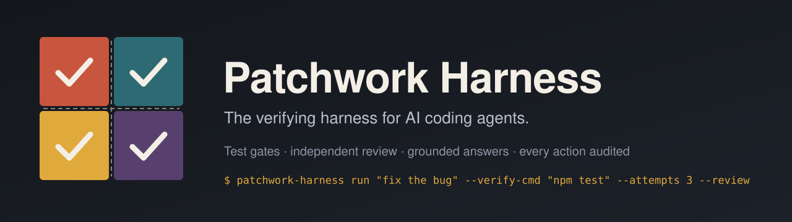
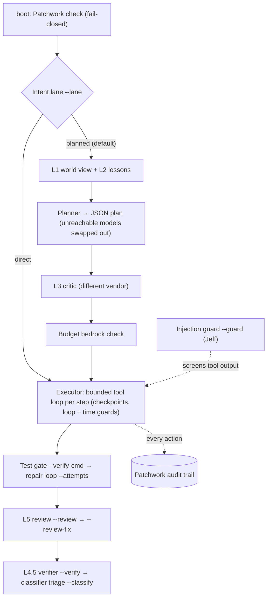

<p align="center">
  
</p>

<p align="center">
  <a href="LICENSE"></a>
  
  <a href="https://github.com/JonoGitty/patchwork-harness/actions/workflows/ci.yml"></a>
  
</p>

# Patchwork Harness

**The verifying harness for AI coding agents.**

AI coding agents are confident. *"Done — all tests pass"* is the most common thing they say, and it is a claim, not a proof. Agents declare bugs fixed that are not fixed, quote numbers no tool ever returned, and pass the tests they were shown while breaking the spec they were not. The better the model, the more convincing the claim.

Patchwork Harness runs your coding agent inside a loop that **checks the work instead of believing it**:

- **Test gate.** Your tests run after the plan; the run fails unless they pass, and a bounded repair loop gets the failure output.
- **Independent review.** A model from a *different vendor* reviews the finished diff read-only against a rubric — every concern must quote evidence.
- **Grounded answers.** A deterministic verifier checks every number, path and quote in the agent's final answer against what its tools actually returned. Its law: **never a false VERIFIED.**
- **Multi-vendor routing.** Plans are routed step by step across Claude, GPT, Gemini, Grok and local models, by tier and evidence — not by brand.
- **Small, fast classifiers, measured first.** Local [Jeff](https://github.com/firelex/jeff) "System 1" models screen tool output for prompt injection and triage claims the verifier can't check, in tens of milliseconds. Each is scored against a constant baseline before anything in the harness trusts it.
- **Audited, budgeted, undoable.** Every action lands on the [Patchwork](https://github.com/JonoGitty/patchwork-audit) audit trail, a hard spend ceiling is never crossed, and `--checkpoint` makes any run rewindable.

Part of the **Patchwork suite**: [patchwork-audit](https://github.com/JonoGitty/patchwork-audit) records what agents do; **patchwork-harness** makes sure what they do is done well.

---

## What it catches

A real run (28 Sept 2026). The goal was a README; a test in the repo exposed a bug the agent was never told about:

```
▸ Step 1/1: Inspect add.sh and add README.md  — anthropic/claude-haiku-4-5
▸ write README.md (54 bytes)  — auto
▸ Verify  — sh test.sh  (up to 3 attempts)
› verify FAILED (exit 1)
▸ Repair (attempt 2/3)  — anthropic/claude-opus-5-5
▸ bash: cat add.sh; cat test.sh; cat README.md; ls  — auto
▸ edit add.sh: replace "$1 - $2"…  — auto
› verify passed on attempt 2
  ✓ verify `sh test.sh` exit 0 after 2 attempt(s)
  checkpoints: step-1, repair-2  (patchwork-harness rewind <session> --to <label>)
  ✓ VERIFIED   number   5   [evt_01M3MFGAN6…]
```

The repair fixed the code and **left the test untouched** — the repair prompt forbids weakening checks. In a second run the check demanded a file the goal never mentioned; the model **refused to fabricate it** and the run correctly failed.

And the independent reviewer, in a real eval run, on work that **passed its visible tests** but broke the spec:

```
L5 review  openai/gpt-6-sol  INCOMPLETE
  ! [high] Negative pages can return items instead of the required empty array.
           For example, page -1 with size 2 slices a five-item array from -4 to -2.
           — "Asking for page 0, a negative page, or a page past the end must return `[]`, never throw."
  ! [low]  The added tests cover pages 1–3 but not the invalid-page requirement.
  L4.5 on the review: 8 cited value(s) verified against real tool output
```

The hidden check agreed: the work was wrong. `--review-fix` hands those concerns to a repair step.

---

## Does it help? Measured, not claimed

`patchwork-harness eval` runs a task suite in fresh repos and scores each run with a **hidden check the agent never sees**. Starter suite, 16 runs per config:

| Config | Passed hidden check | Mean cost | Mean time |
|---|---|---|---|
| baseline | 13 / 16 | $0.17 | 56 s |
| `--verify-cmd … --attempts 3` | 15 / 16 | $0.21 | 61 s |
| `… --review` | 14 / 16 | $0.22 | 71 s |

The independent reviewer agreed with the hidden check on **15 / 16** runs and flagged **both** real failures. `patchwork-harness eval review` calibrates reviewers on planted bugs that *pass the visible tests* (so no test gate can see them):

| Reviewer | Caught planted bugs | Passed good work | $ / review |
|---|---|---|---|
| claude-sonnet-5 | 8 / 8 | 4 / 4 | 0.040 |
| gpt-6-sol | 8 / 8 | 3 / 4 | 0.014 |
| gpt-6-luna | 7 / 8 | 3 / 4 | 0.0007 |

Small samples. The direction matches published harness research, but the evidence is honestly thin. Run your own: `patchwork-harness eval run starter --configs baseline,gate,gate+review --trials 4`.

**Skipping the planner on one-pass jobs** (`--lane direct`). The planner splits every job into about 3 steps of 5 tool turns each. On jobs that don't need that, one direct step does better. Same model (GPT-6 Sol), same build, 16 runs per arm:

| Arm | Passed hidden check | Median time | Input tokens | Cost at equal prices |
|---|---|---|---|---|
| Planned pipeline | 8 / 16 | 61.5 s | 43.9K | $0.264 |
| `--lane direct` | **16 / 16** | **42.2 s** | **16.3K** | **$0.090** |

Across three evals the saving held every time: 46–63% fewer tokens and 30–49% less time. Pass rates swung with day-to-day model variance, so read the quality result as "no worse".

**Classifiers, scored before they're trusted** (`patchwork-harness eval classifier`):

| Job | Constant baseline | Kev-0.8B | **Jeff** |
|---|---|---|---|
| Triage of claims the verifier couldn't check (287 judged claims) | 93.4% | 86.1% (AUC 0.73) | **93.7%** (AUC 0.87), base model |
| Prompt injection in real tool output (150 outputs, each also with a planted injection) | 50% | n/a | **94.3%** (AUC 0.99), `guard` adapter |

At P ≥ 0.9 the guard catches 90% of planted injections, with 1.3% false alarms on real output. Its blind spot is instructions dressed as legitimate project policy.

---

## Quickstart

```bash
# 1. Patchwork is a hard requirement (boot is fail-closed, there is no skip flag)
npm install -g patchwork-audit && patchwork init

# 2. Install the harness
git clone https://github.com/JonoGitty/patchwork-harness.git
cd patchwork-harness
npm ci && npm run build && npm link          # installs `patchwork-harness` and `pwh`

# 3. Keys (stored in ~/.patchwork-harness/.env, mode 0600) — any subset works
pwh keys set ANTHROPIC_API_KEY sk-ant-...
pwh keys set OPENAI_API_KEY sk-...
pwh keys set GEMINI_API_KEY ...

# 4. Check, then run
pwh doctor
pwh run "fix the flaky test in tests/parser.test.ts" \
  --verify-cmd "npm test" --attempts 3 --checkpoint --review
```

Requirements: Node 20+, git, [Patchwork](https://github.com/JonoGitty/patchwork-audit). On Windows the bash tool uses Git Bash.

---

## The trust stack

Every layer is opt-in beyond L1–L3, and **no layer can mark anything green without proof**.

| Layer | What it does |
|---|---|
| **L1** Project awareness | A ~6K-token world view before planning: your memory notes, README/CLAUDE files, git state |
| **L2** Lessons | Similar past sessions and how they went |
| **L3** Critic | A second model, from a different vendor, critiques the plan once |
| **Planner guard** | Any step naming a model the key can't reach is swapped for a reachable one — deterministically |
| **Test gate** `--verify-cmd` | Runs your tests; output becomes audited evidence |
| **Repair loop** `--attempts` | Failure output → one repair step → re-gate, inside the budget |
| **L4.5 Verifier** `--verify` | Deterministic answer-vs-evidence check. VERIFIED (with proof) · UNGROUNDED · MISSED — reported at equal prominence |
| **Classifier triage** `--classify` | Sends L4.5's MISSED atoms to a decision model: a local Jeff (the best measured), TypeSafe Jev or Kev. Routes only; it can never grant green |
| **Intent lanes** `--lane` | `direct` skips the world view, planner and critic for one-pass jobs. `auto` uses a small trained head, and asks a cheap LLM only when the head is unsure. Any doubt runs planned |
| **Injection guard** `--guard` | Jeff's `guard` adapter screens file, shell, search, git and memory output before the model reads it. A hit is flagged, or withheld with `--guard-withhold`. The raw output stays on the audit trail. A guard that was asked for but can't run stops the run |
| **L5 Reviewer** `--review` | Different vendor, read-only (read/grep/glob), rubric + quoted evidence; its citations are L4.5-checked |
| **Review repair** `--review-fix` | An INCOMPLETE verdict → one repair from the reviewer's concerns → re-gate → re-review |

Decision records for every layer live in [`DECISIONS/`](DECISIONS).

## Harness options

| Flag | What it does |
|---|---|
| `--verify-cmd "<cmd>"` | Test gate; the run exits 1 unless it passes |
| `--attempts <n>` | Bounded repair loop (max 10); the repair step may not edit the tests |
| `--checkpoint` | Git snapshot of the tree before every step (`refs/patchwork-harness/…`), your index/HEAD/branch untouched |
| `pwh rewind <session> [--to <label>]` | List or restore checkpoints; a rewind snapshots first, so it is undoable |
| `--guard-loop` | Nudge when the model repeats an identical call 3+ times |
| `--time-budget <s>` | Wall-clock cap the model can see |
| `--review [model]` / `--review-strict` / `--review-fix` | L5 review, fail on a non-COMPLETE verdict, repair from its concerns |
| `--budget <usd>` / `--bedrock <usd>` | Soft session target / hard ceiling that is never crossed |
| `--lane planned\|direct\|auto` · `--lane-model <id>` | Intent lane, and the direct lane's model (planned is the default) |
| `--guard [p]` · `--guard-withhold` | Injection guard at P(attack) ≥ p (default 0.9); withhold instead of flag |

## Use it from Claude Code (MCP)

`patchwork-harness mcp` serves the harness over MCP, so Claude Code — including Remote Control sessions — drives it with typed tools:

```bash
claude mcp add patchwork-harness -s user -- node /path/to/patchwork-harness/bin/patchwork-harness.mjs mcp
```

16 tools: `harness_plan`, `harness_run` (+ `harness_run_status`), `harness_verify_claude` / `_session` / `_file`, `harness_review`, `harness_ask`, `harness_eval`, `harness_checkpoints`, `harness_rewind`, `harness_models`, `harness_status`, `harness_sessions`, `harness_show`, `harness_exam`. Anything that spends money or changes files requires `confirm: true`; background runs close stdin, so every permission prompt resolves to **deny**.

Audit a Claude Code session's own answer against its tool outputs: `pwh verify claude --classify`.

## Run inside Claude Code (mod)

[`claude-mod/`](claude-mod) is a [Claude Code mod](https://code.claude.com/docs/en/plugins/mods/overview) (Claude Code 2.1.287+). It runs the harness's measured pieces inside Claude Code itself:

- **Injection guard.** `Read`, `Bash`, `Grep`, `WebFetch`, `WebSearch` and MCP output is screened by Jeff's guard before Claude reads it. A hit is flagged or withheld, and you get a toast.
- **`/verify [--classify]`.** L4.5 grounding on the current session. `/verify auto on` checks every answer; it is off by default, because auditing is requested, never forced.
- **`/guard`, `/harness`.** Set the mode and threshold, and see what was caught.

```bash
bash scripts/jeff/serve.sh                      # a local Jeff with the guard adapter, on :8765
claude --plugin-dir /path/to/patchwork-harness/claude-mod
```

`claude plugin validate ./claude-mod --strict` lists exactly what the mod hooks and calls. Its tests drive the real hooks without Claude Code (`tests/claude_mod.test.ts`). Mods are still rolling out, so check `claude plugin test` reports them as on for your account.

## Models

Six providers — Anthropic, OpenAI, Google, xAI, Perplexity (research-only) and local Ollama. The catalog in [`config/models.yml`](config/models.yml) only marks a model *verified* after a real call succeeds (`node scripts/probe_models.mjs`); prices come from vendor pricing pages or say `unknown`. Roles are chosen by evidence — e.g. the planner (`gpt-6-luna`) won a head-to-head where the critic approved 9/12 of its first drafts vs 1/12 for the previous planner (`scripts/eval_planner.ts`).

Routing is by **tier**, not brand: flagship coders for hard steps, workhorses for bulk, cheap models for coordination, reasoning models for review, local models for private writing. See [`config/model_capabilities.yml`](config/model_capabilities.yml).

## Commands

| | |
|---|---|
| `run "<goal>"` | Plan and execute (`--dry-run`, `--json`, `-u` unattended, all harness flags) |
| `ask "<prompt>"` | One call to one model (`-p`, `-m`, `--search` for cited web results) |
| `review <paths>` | Cross-vendor adversarial review, merged and L4.5-checked |
| `verify file\|session\|claude\|exam` | The L4.5 verifier (`--classify` for triage) |
| `eval run\|review\|classifier\|list` | Task suites, reviewer calibration, and classifier scoring on labelled rows (Jeff adapter-kit format) |
| `route "<goal>"` | Preview the lane `--lane auto` would take, and why |
| `rewind <session>` | Checkpoints |
| `mcp` | MCP server |
| `models` · `doctor` · `keys` · `ls` · `show` · `tail` · `web` · `cockpit` · `resume` | Everything else |

Everything is also available as `pwh`.

## Configuration

State lives in `~/.patchwork-harness/` (sessions, events, cache, evals, keys). Put your own `models.yml`, `model_capabilities.yml`, `budget.yml` or `policy.yml` there to override the bundled [`config/`](config). Environment variables use the `PATCHWORK_HARNESS_` prefix, for example `PATCHWORK_HARNESS_JEFF_URL` (a local Jeff for triage and `--guard`), `PATCHWORK_HARNESS_INTENT_URL`, `PATCHWORK_HARNESS_SHELL` and `PATCHWORK_HARNESS_ENABLE_CONTEXT_INJECTION`.

## Architecture



More in [`ARCHITECTURE.md`](ARCHITECTURE.md) and [`SECURITY.md`](SECURITY.md).

## Status

**v0.2.0. Early, and honest about it.** It works end to end, the suite has 520+ tests, and every number above comes from real runs. Known limits:

- **L4** (the live re-planner) is designed, not built.
- **`--lane auto` on chat-style text** is weak. On the 224 labelled requests, a model that sees only length and punctuation scores within 3 points of the trained intent head. Route self-contained goals, not chat messages.
- **The injection guard is detection and defence in depth, not a security boundary.** Every current model we tried resisted our planted injections even without it. Policy-framed instructions get through the guard.
- **The Claude Code mod** is statically validated and tested offline. It hasn't run live yet: mods are still rolling out.
- **Two tests fail on Windows only** (POSIX file modes and a path-matching test).
- **Eval samples are small.** The suite is cheap (about $0.20 a run), so run more, with the arms interleaved.

See [`CHANGELOG.md`](CHANGELOG.md).

## Credits

- **[Jeff](https://github.com/firelex/jeff)** by Mathias Strasser: the open "System 1" decision models and adapters behind `--guard`, `--classify` and the mod's guard. Code MIT, weights Apache 2.0. It is built on [AutoJev](https://github.com/denis-pplx/autojev) by Denis Yarats.
  - Patchwork Harness does **not** bundle Jeff. It talks to a Jeff server you run, over Jeff's HTTP API.
  - Our classifier row files use Jeff's adapter-kit format, so they also work with `jeff-kit`.
- **The System One request format** comes from TypeSafe's Jev. Jeff and Kev ([jaredpalmer/kev](https://github.com/jaredpalmer/kev)) serve the same format.
- **[Claude Code mods](https://code.claude.com/docs/en/plugins/mods/overview)** by Anthropic.

## License

[Business Source License 1.1](LICENSE), matching the rest of the Patchwork suite: free for internal and non-competing commercial use; each version converts to **Apache 2.0** three years after release.
